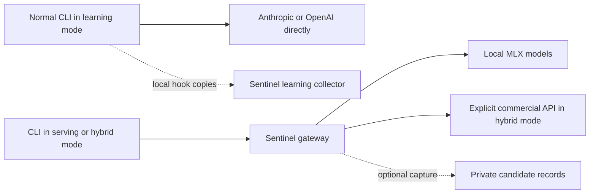

# Use Sentinel with Claude Code and Codex

Sentinel has three operating modes. Choose the inference path first, then choose
whether to retain conversation copies for evaluation. Capturing a conversation
does not automatically train a model, grade its answer, or change how it is billed.

| Mode | Who answers the CLI? | Where Sentinel sits | Billing | Capture |
| --- | --- | --- | --- | --- |
| **Serving** | Your configured local models in MLX-Flash | Between CLI and local runtime | No commercial model call | Off by default; opt in with `--training-mode` |
| **Learning** | The original Anthropic/OpenAI service | A separate collector receiving hook copies | The normal CLI authentication/subscription/API arrangement | Enabled on the collector; hooks must be configured separately |
| **Hybrid** | Local models or an explicitly configured commercial API | Between CLI and either backend | Commercial routes use separately configured API keys | Off by default; opt in with `--training-mode` to retain both paths |



Learning keeps commercial primary traffic outside Sentinel. Hybrid sends
commercial primary traffic through Sentinel. Neither mode automatically sends
every request to two models; automatic shadow replay and response comparison
are future work. You can preserve commercial references now without claiming
that a corresponding local answer was generated or evaluated.

## What is implemented

* Anthropic Messages, OpenAI Responses and Chat Completions adapters for text
  and supported client-executed tools. Responses supports one-level function
  namespaces and the installed Codex canonical `apply_patch` grammar.
* Qwen-native function/parameter calls alongside the previous JSON envelope.
  Invalid tool names, schemas, tool choice, incomplete output and incomplete
  Opus thinking are rejected before dispatch. One formatting correction keeps
  the selected backend and output budget pinned.
* Direct-client capture hooks, a private collector, optional proxy capture,
  measured-usage provenance, bounded retention and live capture controls.
* Deterministic role/effort hybrid policy, live role output budgets, Claude lab
  status line, terminal controls, and generated slash commands/custom prompts.

Jes is not trained or connected. The protocol gate checks executable structure;
it does not judge factual accuracy, coding quality or task success. All captured
candidates remain `unscored` and `training_eligible: false`. See the
[actual client probes and accounting limits](client-quality-inspection.md).
For the existing legacy helpers, the proposed Kev-0.8B/Jeff OSS decision bridge
and eventual Jes replacement, see the [decision migration design](jes-decision-design.md).

## Start with the local lab

From the Sentinel repository, after building/installing the updated MLX-Flash
runtime and selecting already cached model paths:

```sh
rtk make lab-init
rtk make lab-test
rtk make lab-rebuild
rtk make lab-status
rtk make lab-doctor
rtk make lab-claude
```

`lab-rebuild` restarts owned lab services; run it between conversations or after
an active generation completes. A rebuild does not update the selected
MLX-Flash installation. To change that installation, supply its executable
explicitly using `MLX_FLASH_BIN`, together with the cached model selections as
described in [local gateway setup](local-gateway.md).

The three-role lab maps Haiku to the small artifact, Sonnet to the large artifact,
and Opus to the large artifact with thinking enabled. Default output budgets are
1024, 4096 and 8192 respectively. These are local profiles behind familiar
client model names, not Anthropic model weights or a guarantee of equivalent
quality. Claude `opusplan` and its configured subagents select those logical
roles; Sentinel owns the backend mapping.

Use `rtk make lab-codex` to launch the isolated Codex profile once the gateway
advertises Responses and tool support. The basic real Codex turn was verified;
unsupported images, provider built-ins, arbitrary custom tool grammars and
stored Responses histories still reject explicitly. Local SSE is buffered until
validation completes, so the UI waits for the model rather than seeing live
decode tokens. Existing model metadata warnings can still appear in Codex.

## Keep subscription-backed CLI traffic direct and collect references

Build and start a separate collector; it needs no model runtime or provider key:

```sh
rtk make gateway-build
rtk ./bin/sentinel-gateway --listen 127.0.0.1:19094 \
  --mode learning --training-dir /private/tmp/sentinel-reference-data
```

Keep normal Claude Code/Codex pointed at their original vendor. The isolated
local lab launcher is for local serving, not for subscription-backed learning.
Preview the opt-in hooks before adding them to the chosen normal CLI settings:

```sh
rtk ./bin/sentinel-tools capture --client claude \
  --output /private/tmp/sentinel-client-capture/claude.jsonl \
  --collector http://127.0.0.1:19094/sentinel/training/events \
  --billing-class subscription --preview-config

rtk ./bin/sentinel-tools capture --client codex --native-hooks \
  --output /private/tmp/sentinel-client-capture/codex.jsonl \
  --collector http://127.0.0.1:19094/sentinel/training/events \
  --billing-class subscription --preview-config
```

Create the spool parent as a private directory first. `subscription` is an
explicit statement of your arrangement, not an authentication switch; use
`api` or the default `direct_unknown` where appropriate. Previews install
nothing. Follow [hook setup](client-capture.md) to preserve existing settings
and review Codex hook trust. Claude's bare lab disables these hooks; configure
them in the normal commercial CLI instead.

Hooks write the private local spool first. Collector outages do not block the
commercial conversation. Copies are bounded transcript evidence and can omit
hidden prompts, binary content and earlier history; they are not complete wire
mirrors. Automatic replay of offline spools is not implemented.

## Use hybrid routing and save both local and commercial candidates

Run a separate hybrid gateway, selecting commercial model IDs explicitly and
providing key **environment variable names**, not keys in command arguments:

```sh
rtk ./bin/sentinel-gateway --listen 127.0.0.1:19100 --mode hybrid \
  --role-haiku-upstream http://127.0.0.1:19092/v1 \
  --role-sonnet-upstream http://127.0.0.1:19091/v1 \
  --role-opus-upstream http://127.0.0.1:19091/v1 \
  --allow-paid-api \
  --anthropic-base-url https://api.anthropic.com \
  --anthropic-model YOUR_ANTHROPIC_MODEL \
  --anthropic-api-key-env SENTINEL_ANTHROPIC_API_KEY \
  --openai-base-url https://api.openai.com/v1 \
  --openai-model YOUR_OPENAI_MODEL \
  --openai-api-key-env SENTINEL_OPENAI_API_KEY \
  --training-mode --training-dir /private/tmp/sentinel-hybrid-data
```

Replace model placeholders and set the selected key variables only in the
gateway process. Configure the chosen CLI's provider base URL to this gateway;
the isolated lab launcher otherwise continues to use port 19090. Commercial
API keys are separate from normal subscription login. Sentinel does not forward
CLI OAuth credentials, cookies or inherited client Authorization headers.

| Live hybrid policy | Routing decision |
| --- | --- |
| `local-only` | Keep all supported requests local |
| `balanced` (startup default) | Route Opus/high or xhigh Responses reasoning to the configured matching vendor; keep lighter requests local |
| `quality` | Use the matching configured commercial provider for all supported requests |

If no matching commercial provider is configured, the request stays local.
Commercial failures are returned to the caller without an automatic provider
switch or paid retry. A policy name does not prove measured quality or savings.
See [hybrid billing and configuration](hybrid-billing.md) for exact boundaries.

## Control a configured process from the CLI

| Purpose | Bare Claude lab plugin | Codex custom prompt |
| --- | --- | --- |
| Status | `/sentinel:status` | `/prompts:sentinel-status` |
| Capture on/off | `/sentinel:training-on`, `/sentinel:training-off` | `/prompts:sentinel-training-on`, `/prompts:sentinel-training-off` |
| Hybrid policy | `/sentinel:policy-local`, `/sentinel:policy-balanced`, `/sentinel:policy-quality` | `/prompts:sentinel-policy-local`, `/prompts:sentinel-policy-balanced`, `/prompts:sentinel-policy-quality` |
| Restore role budget | `/sentinel:profile-haiku`, `/sentinel:profile-sonnet`, `/sentinel:profile-opus` | `/prompts:sentinel-profile-haiku`, `/prompts:sentinel-profile-sonnet`, `/prompts:sentinel-profile-opus` |

The lab seeds these assets without replacing custom files. Launch a new Claude
lab session to load its explicit plugin. Normal Claude installations can use
the generated `/sentinel-status` command files. Codex custom prompts need a new
session and remain its documented, deprecated prompt extension.

Commands target port 19090 by default. For a collector or hybrid gateway, generate
assets with its explicit endpoint or use terminal controls directly:

```sh
rtk ./bin/sentinel-tools control --endpoint http://127.0.0.1:19094 status
rtk ./bin/sentinel-tools control --endpoint http://127.0.0.1:19094 training off
rtk ./bin/sentinel-tools control --endpoint http://127.0.0.1:19100 policy balanced
rtk ./bin/sentinel-tools control --endpoint http://127.0.0.1:19100 profile opus 8192
```

Capture-on requires storage configured at startup; policy changes require
hybrid configured at startup. Commands cannot enable paid authorization, install
keys, change operating mode, choose a different model artifact, or change a
direct commercial CLI's model. Role controls change output limits, not model
weights or context capacity. Slash assets are model-assisted and use normal CLI
permissions/tokens; the terminal controller itself makes no model call.

Capture-off pauses Sentinel persistence. It does not stop client hook spools,
erase retained data, or cancel an in-flight inference. Details:
[client controls](client-controls.md), [retention and dataset admission](training-mode.md).

## Read measurements without inventing costs

`rtk make lab-live-status` returns telemetry JSON; `rtk make lab-statusline`
adds the live Claude status line while preserving an existing custom one.
Distinct runtime call/token counters must not be mistaken for completed user
turns. Sonnet/Opus share one runtime; machine RAM/swap must not be added twice.

Updated MLX-Flash reports native prompt/output counts and a capability marker.
Legacy zero prompt counts remain unknown accounting evidence. Hooks preserve
reported usage and scope; hybrid preserves full vendor usage. Reasoning is a
subset of output. Actual counts, a rate-card estimate and the amount billed are
different quantities. No USD estimator or invoice integration is implemented;
subscription allowance must not be priced as retail API charges.

Continue with [live status](claude-lab-status.md),
[MLX measurement scope](https://github.com/szibis/mlx-flash/blob/main/docs/generation-measurements.md),
and [measured quality and accounting limits](client-quality-inspection.md).
