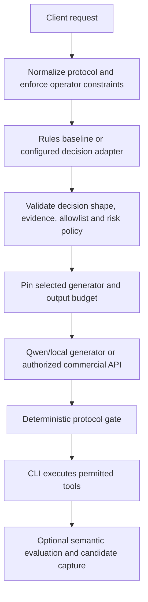

# Design: replace decision helpers with an OSS bridge, then Jes

Status: proposed next-stage integration. PR #40 supplies client protocols,
capture, deterministic routing and operator controls. It does **not** load an
OSS decision checkpoint or a trained Jes checkpoint. This design separates
what is running from the migration we intend to implement.

## Separate decisions from answers

Sentinel needs a small decision service to classify work, select an allowed
route and assess evidence. It also needs generative models to answer, plan and
produce tool arguments. These are different contracts:

| Responsibility | Current implementation | Interim target | Long-term target |
| --- | --- | --- | --- |
| Answer generation and tools | Qwen3.5-4B for Haiku; Qwen3.6-35B-A3B for Sonnet/Opus | Keep these local generators; evaluate upgrades independently | Our evaluated generative checkpoints, optionally mixed with commercial APIs |
| Local role selection | `DecisionRouter` with `RoleRouter`/`LocalRouter` | OSS decision adapter behind the same policy boundary | Jes adapter without changing client protocols |
| Hybrid commercial selection | Deterministic role/reasoning-effort policy | OSS advice constrained by operator permissions | Calibrated Jes advice under the same constraints |
| Protocol quality | Complete-output/tool/schema/choice validation | Retain deterministic validators | Retain validators even after learned scoring is added |
| Semantic/task quality | Unscored capture plus reviewed regression probes | OSS evidence assessment in shadow evaluation | Jes scoring after held-out task and calibration gates |
| Semantic embeddings/cache search | Legacy model-manager configuration | A real separately evaluated embedding backend, if needed | Retain a separate embedding service unless Jes gains a validated embedding contract |

Jes is a typed decision model, not a drop-in replacement for an embedding vector,
an autoregressive coding model or a deterministic security rule. Calling the
Qwen answer model “Jes” would hide the missing decision readout and training.

## Inventory the existing helpers honestly

The legacy [`internal/models` configuration](../internal/models/config.go)
names DistilBERT intent classification, an Isolation Forest anomaly model and
MiniLM embeddings. Its [manager](../internal/models/manager.go) currently uses
stub inference: intent `unknown` with a fixed score, a fixed anomaly result,
and a zero embedding vector. Names/configuration/download support do not prove
those models are executing. The legacy intent classifier also has keyword and
feedback logic; the local gateway's route selector is separate from that path.

Migration must remove reliance on fixed helper outputs rather than presenting
them as model evidence. Preserve exact rules and existing safe fallbacks while
introducing a real decision adapter. Do not replace security validation with
an uncertain learned score or reuse a decision probability as an embedding.

## Interim OSS decision backend

**Kev-0.8B is the proposed first architectural match** for Jes's Qwen-based
candidate scorer. It combines a Qwen backbone, an adapter and a candidate-scoring
pointer head, and documents MLX serving. This is a design choice based on
architecture, not an independently measured superiority claim.
[Kev architecture and serving](https://github.com/jaredpalmer/kev#how-it-works).

**Jeff-Qwen3.5-0.8B is the comparison candidate**: a small Qwen decision model
with probability output, domain adapters and MLX serving. It offers a practical
challenger to test before committing to an architecture.
[Jeff project](https://github.com/firelex/jeff).

Laya provides an encoder-based comparison; jevos provides a local CPU decision
baseline. Neither is assumed to match a Qwen-derived Jes scorer or to be
interchangeable through a Chat Completions endpoint.
[Laya](https://github.com/NandhaKishorM/laya),
[jevos](https://github.com/feder-cr/jev).

Pin the chosen code, base model, adapter, tokenizer, precision and calibration
revision before evaluation. Run candidates sequentially on this Mac first and
measure cold/warm latency, peak memory, evidence limits, option permutations,
abstention and downstream task outcomes. Published timings from other hardware
are not our measurements. Downloads, installations and new paid benchmarks are
separate explicit steps; no command in PR #40 enables these backends.

## Stable Sentinel decision contract

Introduce a backend-neutral decision service independent of the answer
runtime. Proposed Jes-native serving is `POST /v1/decisions`; each OSS adapter
maps its actual native API into this contract. Do not expose the decision
service as a Claude or OpenAI answer model.

Proposed request fields:

* A request/turn identity and bounded trusted state: client role/effort,
  required tool capabilities, available evidence, measured input size and
  resource state. Conversation/tool text stays explicitly untrusted.
* Named boolean or choice questions with explicit descriptions and a dynamic
  allowlist of candidates. Include `abstain` or `insufficient_evidence` where
  meaningful. Start with 2–32 options and a measured 2048-token per-question
  pilot ceiling; reject overflow instead of clipping decisive evidence.
* Immutable policy constraints: configured roles, allowed providers, paid
  authorization, budget ceilings and current capture mode. The decision model
  cannot broaden these constraints or supply an endpoint/credential.

Proposed result fields:

* Per-option probabilities, selected candidate and explicit availability.
* Backend/checkpoint/adapter/precision/calibration identity, measured usage,
  latency, evidence coverage and a decision trace identifier.
* A separate policy action: use, abstain, escalate or retain the baseline.

Model probabilities are not permission and are not proof of correctness.
Do not invent calibrated confidence for a rules policy or a checkpoint without
a calibration artifact. Keep ordinal score support out of the first integration
until labels and evaluation establish its semantics.

## Routing and quality policy

Client-explicit roles remain binding unless an operator has explicitly selected
a policy that permits adaptive selection. A timeout, invalid result, unavailable
checkpoint or insufficient evidence retains the configured baseline or returns
an explicit failure. It never silently enables a paid route. Corrections and
tool continuations preserve their route identity and measured cost.

Semantic scoring runs on actual request/answer/tool evidence. A proposed
`needs_stronger_model` decision cannot change which tools were executed or
pretend failed work succeeded. Escalation requires policy permission and budget;
paid retries/shadow requests stay independently opt-in. Capture every attempt
with its role and provenance rather than reporting only the final success.

## Migration stages and exit criteria

1. **Inventory and baseline:** identify which legacy callers consume helper
   stubs, preserve deterministic rules, and add representative routing/quality
   fixtures with honest source labels. No model swap yet.
2. **OSS shadow adapter:** load a pinned Kev-0.8B checkpoint in an isolated
   decision runtime; keep production route decisions unchanged. Compare Jeff
   under the same task splits. Prove bounded input, valid probabilities,
   endpoint isolation, cancellation/timeout behavior and no credential access.
3. **Restricted OSS routing:** permit only reviewed local route choices after
   held-out evaluation and calibration. Measure downstream success, escalation
   frequency, total latency/token use, and resource contention. Keep rollback
   to rules and make any commercial extension separately authorized.
4. **Jes training:** train an independently identified scorer/readout on reviewed
   data; record backbone and dataset provenance, grouped splits, checkpoint
   save/reload, calibration and frozen evaluation reports. Captured commercial
   answers are references, not automatic gold labels.
5. **Jes shadow and promotion:** compare Jes with the same OSS and rules
   baselines, then switch the decision adapter after acceptance. Client model
   names, answer backends, wire adapters and billing rules remain stable.

Acceptance thresholds must be chosen and frozen before evaluation, including
an accepted-error bound and abstention policy. “Matches commercial quality”
requires representative downstream evidence, not a schema pass, high softmax
value, or a fast single example. Report uncertainty and failures per task slice.

## Observability and controls to add later

Future controls may select `rules`, `oss-shadow`, `oss-enforced`, `jes-shadow`
or `jes-enforced` **only** from preconfigured adapters. Report the active backend,
checkpoint/calibration revision, selected route, abstentions, timeout/fallback
reason, semantic-gate result and comparison pair ID. Mode changes and commercial
authorization remain explicit operator actions.

These settings are design targets, not working flags or slash commands in
PR #40. Today's controls expose status, capture pause/resume, hybrid policy and
role output budgets. See [current user guide](client-modes.md) and
[current control contract](client-controls.md).
